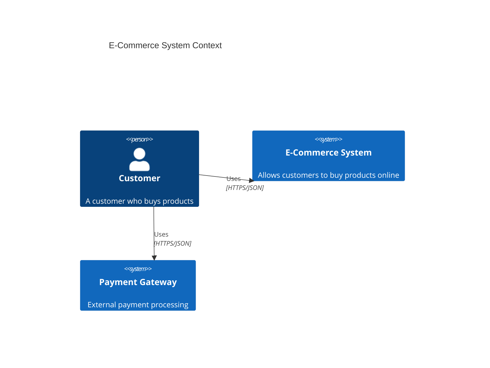

# 🏗️ C4 Architecture Expert MCP Server

Um servidor MCP (Model Context Protocol) especializado no **C4 Model** (Simon Brown), oferecendo ferramentas para geração de diagramas arquiteturais em Mermaid.js e Structurizr DSL.

## ✨ Funcionalidades

### 🔧 Ferramentas Disponíveis

| Ferramenta                 | Descrição                                                                          |
| -------------------------- | ---------------------------------------------------------------------------------- |
| `generate_mermaid_c4`      | Gera código Mermaid.js compatível com diagramas C4 (Context, Container, Component) |
| `generate_structurizr_dsl` | Gera workspace completo em Structurizr DSL para versionamento "Diagrams as Code"   |
| `validate_c4_hierarchy`    | Valida se a estrutura respeita as regras de abstração do C4 Model                  |

### 📚 Recursos (Resources)

- `docs://c4-levels` - Guia dos 4 níveis do C4 Model com descrições detalhadas
- `docs://mermaid-syntax` - Referência de sintaxe Mermaid C4

### 💡 Prompts

- `design_system_architecture` - Prompt sistêmico que guia o LLM para atuar como Arquiteto C4

## 🚀 Instalação

### Pré-requisitos

- Python 3.12+
- pip

### Setup

1. Clone o repositório ou navegue até a pasta:

```bash
cd c4-architecture-expert
```

2. Crie um ambiente virtual:

```bash
python -m venv venv
source venv/bin/activate  # Linux/Mac
# ou
venv\Scripts\activate  # Windows
```

3. Instale as dependências:

```bash
pip install -e .
# ou
pip install "mcp[cli]" pydantic
```

## ⚙️ Configuração no Cursor

Adicione ao arquivo `~/.cursor/mcp.json`:

```json
{
  "mcpServers": {
    "c4-architecture-expert": {
      "command": "/caminho/para/venv/bin/python",
      "args": ["/caminho/para/c4-architecture-expert/c4_architect.py"]
    }
  }
}
```

## 🧪 Testando o Servidor

### Modo Desenvolvimento (Interface Web)

```bash
mcp dev c4_architect.py
```

### Modo Produção (stdio)

```bash
mcp run c4_architect.py
```

## 📖 Exemplos de Uso

### Gerando diagrama C4 Context em Mermaid

**Input:**

```json
{
  "title": "E-Commerce System Context",
  "diagram_type": "Context",
  "elements": [
    {
      "name": "Customer",
      "type": "Person",
      "description": "A customer who buys products"
    },
    {
      "name": "E-Commerce System",
      "type": "System",
      "description": "Allows customers to buy products online"
    },
    {
      "name": "Payment Gateway",
      "type": "System",
      "description": "External payment processing"
    }
  ]
}
```

**Saída:**



### Validando hierarquia C4

**Input:**

```json
{
  "hierarchy": {
    "E-Commerce System": {
      "Web Application": [
        "ProductController",
        "CartService",
        "OrderRepository"
      ],
      "API Gateway": ["AuthMiddleware", "RateLimiter"]
    }
  }
}
```

**Saída:**

```
✅ Estrutura C4 Válida! A hierarquia System -> Container -> Component está correta.
```

## 🎯 Os 4 Níveis do C4 Model

1. **System Context** - Visão de alto nível: Sistema + Usuários + Sistemas Externos
2. **Container** - Zoom no sistema: Aplicações (Web, Mobile), APIs, Databases
3. **Component** - Zoom em um Container: Módulos/Classes/Camadas internas
4. **Code** - Diagramas UML de classes (geralmente muito detalhado)

## 📁 Estrutura do Projeto

```
c4-architecture-expert/
├── c4_architect.py    # Servidor MCP principal
├── pyproject.toml     # Configuração do projeto
└── README.md          # Este arquivo
```

## 🧠 Benefícios

### Diagramas como Código

Gere diagramas versionáveis em Mermaid ou Structurizr DSL, permitindo controle de versão e automação.

### Validação Automática

O validador `validate_c4_hierarchy` garante que sua arquitetura respeita as regras de abstração do C4.

### Integração com IA

O prompt `design_system_architecture` permite que assistentes de IA atuem como arquitetos C4 experientes.

## 🤝 Contribuindo

1. Faça um fork do projeto
2. Crie uma branch para sua feature (`git checkout -b feature/nova-feature`)
3. Commit suas mudanças usando Conventional Commits (`git commit -m 'feat: add nova feature'`)
4. Push para a branch (`git push origin feature/nova-feature`)
5. Abra um Pull Request

## 📝 Licença

Este projeto está sob a licença MIT.

## 🔗 Links Úteis

- [C4 Model](https://c4model.com/)
- [Structurizr](https://structurizr.com/)
- [Mermaid C4 Diagrams](https://mermaid.js.org/syntax/c4.html)
- [MCP Protocol](https://modelcontextprotocol.io/)
